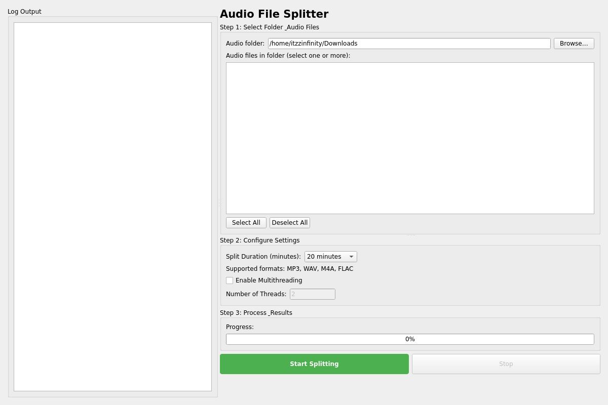
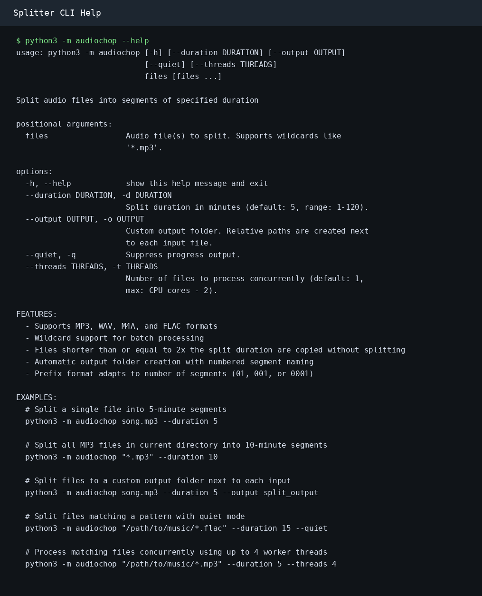
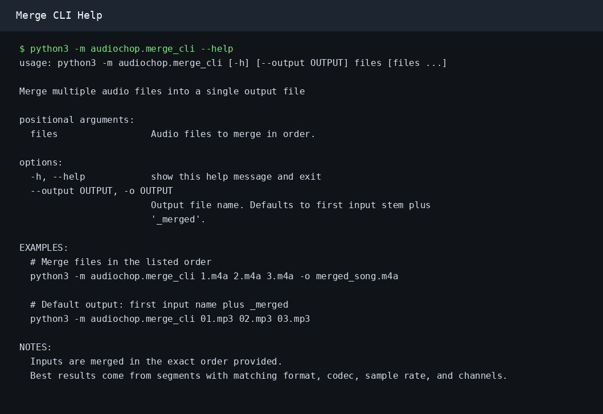

# AudioChop

A PyQt6-based GUI and CLI application for splitting audio files into user-defined segments.

## Features

- **Multi-file Support**: Select and process multiple audio files at once
- **Flexible Duration**: Choose split duration from 1-120 minutes via dropdown
- **Format Support**: MP3, WAV, M4A, and FLAC audio formats
- **Smart Naming**: Auto-calculates prefix padding (01, 001, 0001) based on segment count
- **Error Handling**: Graceful error messages and continues processing on failures
- **Progress Feedback**: Real-time log output showing processing status
- **Short File Handling**: Automatically copies audio files shorter than or equal to 2x the split duration
- **Background Processing**: Audio processing runs in separate thread to prevent UI freeze
- **Lower Memory Usage**: Uses ffprobe/ffmpeg per segment instead of loading full files into Python memory
- **CLI Support**: Batch processing, wildcard input, quiet mode, and optional worker threads

## Installation

### Requirements
- Python 3.8+
- ffmpeg and ffprobe available in `PATH`

### Setup

1. Install ffmpeg (if not already installed):
   ```bash
   # Ubuntu/Debian
   sudo apt-get install ffmpeg
   
   # macOS
   brew install ffmpeg
   
   # Windows
   # Download from https://ffmpeg.org/download.html
   ```

2. Install Python dependencies:
   ```bash
   pip install -r requirements.txt
   ```

3. Optional: install as a package for use from other projects:
   ```bash
   python3 -m pip install .
   ```

## Modes

### GUI — Visual Interface

A PyQt6 desktop application for selecting files, configuring settings, and watching live progress.

```bash
python3 -m audiochop.launch
```



The log panel sits on the left. Drag the vertical divider to resize it. Drag the horizontal divider in the right panel to resize the file browser area independently.

→ Full GUI guide: [README_GUI.md](README_GUI.md)

---

### CLI — Terminal & Batch Processing

A command-line interface for scripting, wildcards, and automated pipelines. Also includes a merge tool to combine segments back into one file.



```bash
# Split a single file
python3 -m audiochop song.mp3 --duration 20

# Split all m4a files with 4 parallel threads
python3 -m audiochop "*.m4a" --duration 20 --threads 4

# Merge segments back together
python3 -m audiochop.merge_cli 01.m4a 02.m4a 03.m4a -o merged.m4a
```



→ Full CLI guide: [README_CLI.md](README_CLI.md)

---

### Output

Each input file creates a folder beside the source with numbered segments:

```
song/
├── 01 - song.mp3   (0:00 - 5:00)
├── 02 - song.mp3   (5:00 - 10:00)
└── 03 - song.mp3   (10:00 - 15:00)
```

Files shorter than or equal to twice the split duration are copied as `01 - original-name.ext` without splitting.

## File Structure

```
/split/
├── audiochop/              # Installable package entry points
│   ├── __main__.py         # python3 -m audiochop
│   ├── launch.py           # python3 -m audiochop.launch
│   ├── cli.py              # Splitter CLI module
│   ├── gui.py              # GUI module
│   ├── merge_cli.py        # Merge CLI module
│   └── processor.py        # Core audio processing logic
├── pyproject.toml         # Package metadata
├── requirements.txt       # Python dependencies
├── README.md             # This file
└── FSD.md                # Functionality Specification Document
```

## Python API

After installing the package, import the splitter in another project:

```python
from audiochop import AudioProcessor, split_audio_file, split_multiple_files

split_audio_file("/home/me/Downloads/song.m4a", 20)
```

For progress logs:

```python
from audiochop import AudioProcessor

processor = AudioProcessor(progress_callback=print)
processor.split_audio_file("/path/to/song.mp3", 10)
```

For merging:

```python
from audiochop import merge_audio_files

merge_audio_files(["01.m4a", "02.m4a", "03.m4a"], "merged_song.m4a")
```

Core API reference:

- `AudioProcessor(progress_callback=None, segment_callback=None, cancel_callback=None)`
- `AudioProcessor.split_audio_file(input_filepath, split_duration_minutes, output_folder=None) -> bool`
- `AudioProcessor.split_multiple_files(input_filepaths, split_duration_minutes) -> dict`
- `AudioProcessor.planned_segment_count(input_filepath, split_duration_minutes) -> int`
- `split_audio_file(input_filepath, split_duration_minutes, output_folder=None, progress_callback=None) -> bool`
- `split_multiple_files(input_filepaths, split_duration_minutes, progress_callback=None) -> dict`
- `merge_audio_files(input_files, output_file) -> pathlib.Path`

## Error Handling

The application handles various error scenarios:
- **Unsupported Format**: Notifies user and skips the file
- **File Not Found**: Displays error message in log
- **Permission Issues**: Shows error and continues with other files
- **Audio Processing Errors**: Logs detailed error information

## Dependencies

- **PyQt6**: GUI framework
- **ffmpeg/ffprobe**: Audio codec and duration support (system requirement)

## Troubleshooting

### ffmpeg not found
Make sure ffmpeg is installed and in your system PATH.

### Audio format not supported
Ensure your audio file is in one of the supported formats: MP3, WAV, M4A, or FLAC.

## Performance Notes

- Processing large files (>500MB) may take several minutes
- The application runs audio processing in a background thread
- UI remains responsive during processing
- Progress is logged in real-time

## License
This project is licensed under the [MIT License](https://opensource.org/licenses/MIT). See the LICENSE file for details.
